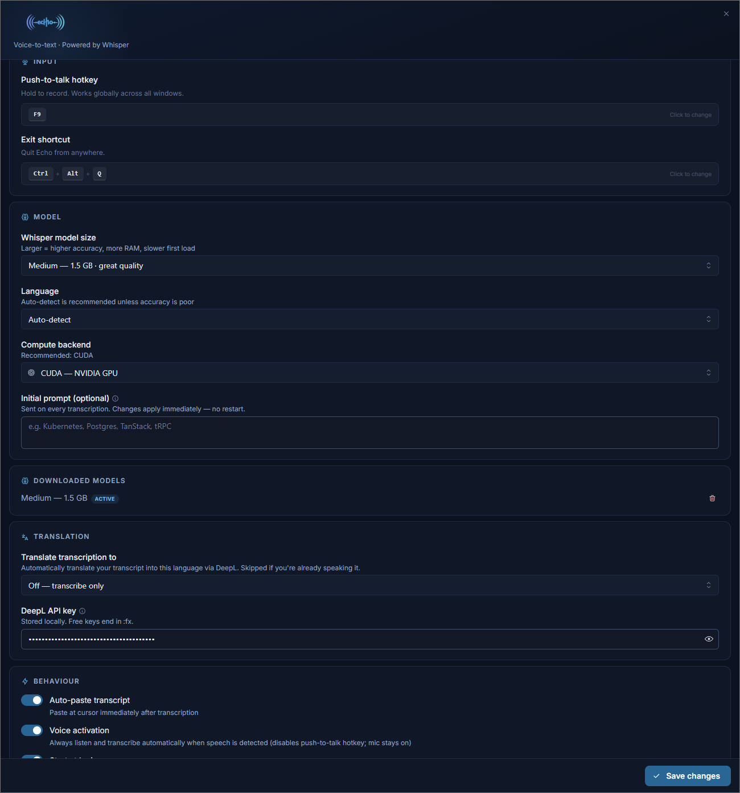

<p align="center">
  
</p>

<p align="center">
  <b>Local voice-to-text for Windows.</b><br/>
  Hold a hotkey or just start talking; the transcript gets pasted where your cursor is.
</p>

<p align="center">
  <a href="https://github.com/Kenshiin13/echo/releases"></a>
  
  
</p>

---

<p align="center">
  
</p>

## Features

- Push-to-talk hotkey (default `F9`) that works in any app
- Voice activation mode (Silero VAD) if you don't want to hold a key
- Whisper runs locally via [whisper.cpp](https://github.com/ggml-org/whisper.cpp) — audio stays on your machine
- CUDA acceleration if you have an NVIDIA GPU, CPU fallback otherwise
- Optional DeepL translation into a target language of your choice
- Five Whisper model sizes: `tiny`, `base`, `small`, `medium`, `large-v3-turbo`
- 14 language presets plus auto-detect
- Auto-paste at cursor, or clipboard-only
- Lives in the system tray; can start at login

## Install

Download the latest installer from the [Releases page](https://github.com/Kenshiin13/echo/releases/latest) and run it.

On first launch Echo downloads the selected Whisper model (`base` by default) and, if you have an NVIDIA GPU and pick the CUDA backend, the matching whisper.cpp binary.

## Usage

**Push-to-talk (default):**

1. Hold `F9` (or whatever hotkey you set).
2. Speak.
3. Release. Transcript is pasted into the focused text field.

**Voice activation:**

Open Settings, toggle **Voice activation** on, save. Echo then listens continuously and transcribes each utterance as you speak. The mic stays live; the hotkey is disabled while this is on.

## Configuration

Settings are available from the tray icon and persisted in your user data directory.

| Setting | Default | Notes |
|---------|---------|-------|
| Push-to-talk hotkey | `F9` | Any key or modifier combo |
| Exit shortcut | `Ctrl+Alt+Q` | Global quit |
| Model size | `base` | `tiny` / `base` / `small` / `medium` / `large-v3-turbo` |
| Language | Auto-detect | Pin one for a small speedup and to enable the translate-skip optimization |
| Compute backend | Auto | `CPU` or `CUDA`; auto-selected based on hardware |
| Auto-paste | On | Off = copy to clipboard only |
| Voice activation | Off | Always-on mic; disables the push-to-talk hotkey |
| Translate transcription to | Off | Sends the transcript to DeepL for translation |
| DeepL API key | — | Only needed when a translation target is set. Free keys end in `:fx` |
| Start at login | Off | |

## Build from source

Requires Node.js 20+ on Windows.

```bash
git clone https://github.com/Kenshiin13/echo.git
cd echo/electron
npm install --legacy-peer-deps
npm run setup:whisper
npm run dev
```

Package an installer:

```bash
npm run dist:win
```

Pushing a `v*` tag runs the [release workflow](.github/workflows/release.yml) and publishes a GitHub Release with the built artifacts.

## Stack

- [Electron 33](https://www.electronjs.org/), [React 18](https://react.dev/), [Vite 6](https://vite.dev/), [Mantine](https://mantine.dev/), [Tailwind](https://tailwindcss.com/)
- [whisper.cpp](https://github.com/ggml-org/whisper.cpp) via [nodejs-whisper](https://github.com/ChetanXpro/nodejs-whisper) for transcription (model kept resident in a local `whisper-server` subprocess)
- [Silero VAD](https://github.com/snakers4/silero-vad) via [@ricky0123/vad-web](https://github.com/ricky0123/vad) for voice activation
- [DeepL API](https://www.deepl.com/pro-api) (optional) for translation
- [koffi](https://koffi.dev/) for `GetAsyncKeyState`-based global hotkey polling
- [@nut-tree-fork/nut-js](https://github.com/nut-tree/nut.js) for keyboard simulation on paste
- [electron-store](https://github.com/sindresorhus/electron-store) for settings, [electron-builder](https://www.electron.build/) for packaging

## License

MIT
